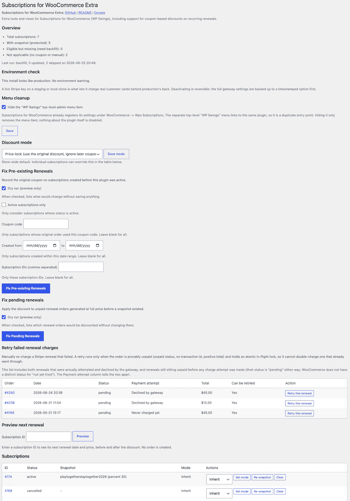

# Subscriptions for WooCommerce Extra

Subscriptions for WooCommerce Extra (or SFW Extra, for short) is a helper plugin for WP Swings' [Subscriptions for WooCommerce](https://wordpress.org/plugins/subscriptions-for-woocommerce/) (WPS SFW) that adds support for coupon-based discounts and a few other quality of life features, including a **Manual renewal retry** button.

With the free version of WPS SFW, subscription renewals are charged at full price regardless of coupon-based discounts used at the time of purchase. This is not what customers expect, and SFW Extra adds coupon-based discounts to their recurring renewals even if the coupon expires, hits its usage limit, or is deleted.

Enable this plugin and renewals carry the original discount. Disable it, and the free WPS SFW plugin's default full-price renewals resume.

SFW Extra was built for the [McMinnville Chess Club](https://macchess.org), and it’s been generalized to work with any site running WooCommerce, WP Swing’s Subscriptions for WooCommerce, and Stripe. If you find this plugin useful, consider [making a donation](https://macchess.org/donate) to the McMinnville Chess Club!

## Features

- Coupon-based discounts for recurring renewals
- Show customers their locked in renewal price on My Account
- Manual renewal retry from the admin page
- Duplicate-renewal protection
- Adding a coupon line to each renewal order so the discount appears in the order and in WooCommerce reports
- An environment check that shows a warning if a live Stripe key is active on a non-production site
- A menu cleanup option to hide the duplicate “WP Swings” admin menu
- Compatible with HPOS (High-Performance Order Storage)

## Requirements

Verified with Subscriptions for WooCommerce 2.0.1, WooCommerce 10.9.4, and with High-Performance Order Storage (HPOS) enabled.

SFW Extra’s version number mirrors the version of WPS SFW that it's known to work with. For example, SFW Extra v2.0.x is known to work with WPS SFW v2.0.x and may not have been tested with newer versions.

## Installation

1. Check that WP Swings’ free (not Pro) **Subscriptions for WooCommerce** is installed and active.
2. Get Subscriptions for WooCommerce Extra from the [releases](https://github.com/christefano/wps-subscriptions-extra/releases) page and copy the `wps-subscriptions-extra` folder to `wp-content/plugins/`, or upload the zip via Plugins -> Add New -> Upload Plugin.
3. Activate **Subscriptions for WooCommerce Extra**.

## Screenshots

[](screenshots/wps-extra-settings.png) _Settings - Overview, Environment check, retry failed renewals, menu cleanup, discount mode, fix pre-existing renewals, fix pending renewals, preview next renewal, and a subscriptions table_

## Configuration

SFW Extra actually works with no configuration. It snapshots new subscriptions and discounts their renewals while it's active.

There are plenty of optional tools and views, however. This plugin’s settings page at **WooCommerce -> WPS Subscriptions Extra** supports a number of optional views and tools:

- **Overview** - counts of total, protected (snapshotted), eligible-but-missing, and not-applicable subscriptions, plus the last-run summary.
- **Environment check** - shows whether this install looks like production and whether a live Stripe key is active, with a **Deactivate live keys** button on non-production installs
- **Retry failed renewal charges** - lists recent unpaid Stripe renewal orders with a per-row **Retry this renewal** button, a **Payment attempt** column distinguishing an actual gateway decline from one never charged yet, and shows why any order cannot be retried.
- **Menu cleanup** - checkbox to hide the base plugin's separate top-level "WP Swings" admin menu item, which duplicates its own settings already registered under WooCommerce -> Wps Subscriptions. Off by default.
- **Discount mode** - store-wide default of *Price-lock* (use the original discount, ignore later coupon changes) or *Honor live coupon* (re-validate the coupon each renewal, respecting expiry and usage limits. Each subscription can override the default in the table.
- **Fix Pre-existing Renewals** - snapshot subscriptions created before the plugin was active, with optional scope: active-only, a specific coupon code, a creation date range, or specific subscription IDs. Dry run is on by default.
- **Fix pending renewals** - apply the discount to unpaid renewal orders that were generated at full price before WPS Extra was enabled and any snapshot existed.
- **Preview next renewal** - show a subscription's next-renewal date and price, before and after the discount, without creating an order.
- **Subscriptions table** - per row, re-snapshot from the parent order, clear the snapshot, or set the discount-mode override.

Requires the `manage_woocommerce` capability. These operations run in the request, and very large stores should use WP-CLI.

## Fix Pre-existing Renewals

Subscriptions created _before_ enabling this plugin have no snapshot. Record one from each subscription's parent order in either of two ways.

**Admin**

Go to **WooCommerce -> WPS Subscriptions Extra**, leave **Dry run** checked to preview, click **Fix Pre-existing Renewals**, then uncheck Dry run and run again to write. Requires the `manage_woocommerce` capability. Backfill runs in the request, so very large stores may prefer the WP-CLI command line.

**WP-CLI:**
```
wp wps-extra fix-preexisting --dry-run   # report only
wp wps-extra fix-preexisting             # write snapshots
```

Both paths share the same logic. Subscriptions that already have a snapshot, manual subscriptions, and those whose parent order is missing or carries no eligible coupon are skipped. Re-running only touches subscriptions still lacking a snapshot (idempotent). Subscriptions are walked through in batches, so this and uninstall cleanup stay memory-bounded on large stores.

## Environment check

A live Stripe key on a staging or local copy can charge real customer cards behind production's back, and this can really ruin your day.

When the site doesn’t look like a production site (a `.local`, `.test`, `.dev`, or `.localhost` host, a `staging`/`dev`/`test`/`qa`/`uat` host label, or a non-production `wp_get_environment_type()`) **and** the WooCommerce Stripe gateway holds a live key (`sk_live_`/`rk_live_` secret or `pk_live_` publishable), a persistent admin notice appears on every screen. It’s red when the key is armed (test mode off, so a renewal here would charge a live card) and yellow when a live key is present but test mode is currently on.

The **Deactivate live keys** button is reversible and destroys nothing:

1. The whole `woocommerce_stripe_settings` array is backed up to a timestamped option (`wps_src_stripe_settings_backup_<UTC timestamp>`).
2. The live secret and publishable keys are blanked.
3. Test mode is forced on.

The gateway's enabled flag and the renewal cron are left untouched. To undo, copy the values from the backup option back into `woocommerce_stripe_settings`. A production site is never nagged: an unrecognized host is still treated as production.

## Manual renewal retry

WPS SFW doesn’t have a retry feature for a failed renewal payment. A renewal that Stripe declines is left as-is (usually `pending`, WooCommerce's default for an order awaiting payment since WooCommerce has no separate status meaning "not yet attempted"), with a WooCommerce order note recording the decline. If a renewal never even reaches the gateway (for example, its cron pass has not run yet), the order is also `pending`, but it carries no such note. SFW Extra has a manual **Retry this renewal** button for Stripe renewals, and it’s built so it cannot double-charge.

Because both cases share the same `pending` status, the table's **Payment attempt** column tells them apart directly: **Declined by gateway** when an order note matches one of the base plugin's known Stripe failure messages ("unable to process your payment", "requires authentication", "charge awaiting authentication"), otherwise it’s **Never charged yet**. Both **Declined by gateway** and **Never charged yet** are legitimately retryable, so the column exists so an admin doesn’t read "pending" as "hasn't been tried."

A retry proceeds only when every one of these holds, re-checked against a freshly reloaded order inside an atomic lock:
- the order is a subscription renewal and its payment method is Stripe (PayPal Standard is refused, as it captures the whole agreement out of band),
- its status is unpaid (`pending`, `failed`, or `on-hold`), never a paid order,
- it carries no transaction id, so no earlier charge succeeded behind a mislabelled status,
- its total is positive and it was not zeroed by the duplicate-renewal guard,
- an atomic in-flight lock (a `UNIQUE`-column `add_option` insert keyed on the order) is acquired, so a double-clicked button or any overlap fires at most one charge.

The lock is released after the retry attempt, so a genuinely failed charge stays retryable. A successful one flips the order out of the unpaid states, so the eligibility gate refuses any further retry regardless. The charge itself is delegated to the base plugin's own Stripe renewal path (`wps_sfw_other_payment_gateway_renewal`), so it stays correct across WPS SFW updates and reuses its gateway's Stripe idempotency handling.

## Menu cleanup

Subscriptions for WooCommerce has two duplicate admin menu items: one as its own top-level **WP Swings** menu item and another as a submenu under **WooCommerce -> Wps Subscriptions**. The **Menu cleanup** checkbox on the SFW Extra settings page hides the top-level duplicate. It’s off by default, and when on it only hides the menu item. Reload wp-admin after saving to see the change.

## Coupon usage limits in live mode

**Price-lock** mode never re-checks the coupon, so its usage limit won't affect renewals at all. **Live mode** does, and a coupon set up for a one-time checkout promo will misbehave if left as-is for recurring use:

- **Usage limit per user** - if set to 1 (a typical signup-promo setting), the customer already used the coupon at signup, so every renewal after that fails re-validation and bills at full price. For a coupon meant to keep discounting a subscription in live mode, set this to unlimited (blank).
- **Usage limit (global, across all customers)** - each renewal that successfully re-validates also records a usage, spending from the same pool as new checkouts. A limited-use coupon like "first 50 new customers" will instead have its pool consumed by renewals of the first few subscribers over time, not just new signups, and will eventually stop working for both. Leave this unlimited for any coupon used in live mode.

Both limits are on the coupon itself (Marketing -> Coupons -> the coupon -> Usage limits tab), not on the subscription.

## Limitations

- Renewals paid via PayPal Standard aren’t supported, and an order note within WooCommerce explains why: PayPal Standard charges the full amount _before_ the renewal order is even created, so discounting the order would not change what the customer was actually charged.
- Coupon-based discounts apply to subscriptions **created while this plugin is active**. Subscriptions created earlier have no snapshot and renew at full price until backfilled with **Fix Pre-existing Renewals** or `wp wps-extra fix-preexisting` via WP-CLI.
- WPS SFW Pro recurring coupon types (`recurring_product_discount`, `recurring_product_percent_discount`) are skipped, because WPS SFW already persists those into the recurring price. Otherwise SFW Extra would double the discount.
- Variable-product subscriptions are not renewed by WPS SFW, so the discount never reaches them.
- `fixed_cart` coupons spend a single flat amount across the order's line items rather than per line, so a multi-line renewal is discounted by the coupon amount once, not once per line.
- Discount stacking order across multiple coupons follows the snapshot order.

## Troubleshooting

**Renewals are still billed at full price**
- Confirm the subscription was created after activation (check for the `_wps_src_recurring_coupons` snapshot meta), the original order actually carried a coupon, and the coupon was a normal type rather than a Pro recurring type.

**Discounts are applied twice**
- The re-entrancy flag (`_wps_src_applied`) prevents double application per renewal order. If you see this, confirm no other customization re-fires `wps_sfw_renewal_order_creation` for the same order.

**Renewals are charged twice**
- A staging or local copy of the site might have live Stripe keys **and** not be in test mode. The environment check is designed to guard against this.

**Customers don’t see their discounted price on My Account**
- The struck-through display appears only when the discount is certain: the subscription has a snapshot, its effective discount mode is price-lock, it is not cancelled, and its payment method is not PayPal Standard. A subscription in live mode intentionally shows the full price, since its renewal amount depends on coupon validation at charge time.

## Uninstall

Uninstalling SFW Extra removes the `_wps_src_recurring_coupons` and `_wps_src_discount_mode` subscription meta (legacy post meta and HPOS order storage), both discount options, the menu-cleanup preference, the stats transient, the per-cycle duplicate-renewal claims, and the manual-retry in-flight locks. The renewal-order flag is harmless and left in place. The Stripe settings backups are left in place on purpose, since they may hold the only copy of blanked live keys ()delete them by hand once you are sure they are no longer needed).

## Changelog

See [CHANGELOG.md](CHANGELOG.md).

## License

GPL v2 or later.